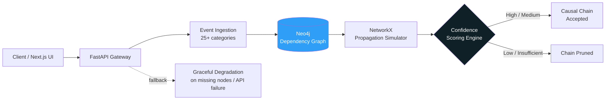
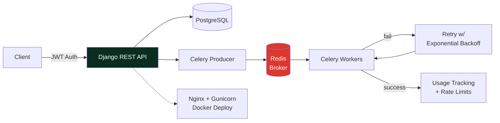
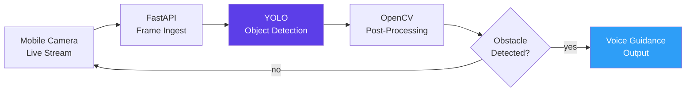
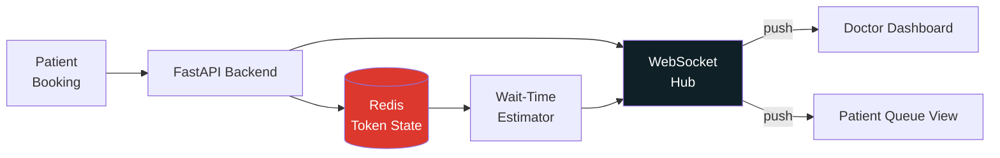

<div align="center">


<br/>

<a href="[https://anirudhakhemriya.dev](https://portfolio-ten-gamma-ld01t3ry5m.vercel.app/)"></a>
<a href="mailto:anirudhakhemriya06@gmail.com"></a>
<a href="https://linkedin.com/in/anirudha-khemriya"></a>
<a href="https://github.com/anirudhkhemriyaa"></a>
<a href="https://leetcode.com/u/Anirudha-khemriya"></a>

<br/><br/>

📍 Gwalior, Madhya Pradesh &nbsp;·&nbsp; 🎯 **Open to Internships** &nbsp;·&nbsp; ⚡ Replies within 24h


</div>

<br/>

```text
anirudha@backend:~$ neofetch

       .---.          anirudha@backend
      /     \         ─────────────────
      \.@-@./         OS:        Ubuntu 22.04 LTS
      /`\_/`\         Shell:     FastAPI / Django REST
     //  _  \\        Editor:    VS Code + tmux
    | \     )|_       Languages: Python, Go, C++, Java
   /`\_`>  <_/ \      Focus:     REST APIs · Graphs · Async · Caching
   \__/'---'\__/      LeetCode:  300+ solved · rating 1462
                       Status:    🎯 open to internships
```

<br/>

## 🏆 Highlights

<table>
<tr>
<td align="center" width="25%">
<h3>🥇</h3>
<b>1st Place</b><br/>
<sub>AI Innovation Hackathon</sub>
</td>
<td align="center" width="25%">
<h3>🎖️</h3>
<b>Top 10 Nationally</b><br/>
<sub>TechRythm Hackathon 2025</sub>
</td>
<td align="center" width="25%">
<h3>📈</h3>
<b>300+ Problems</b><br/>
<sub>LeetCode · Rating 1462</sub>
</td>
<td align="center" width="25%">
<h3>🚀</h3>
<b>4 Shipped Projects</b><br/>
<sub>Real-time · Graph · Async</sub>
</td>
</tr>
</table>

## 💻 Tech Arsenal

<table>
<tr>
<td width="140"><b>Languages</b></td>
<td></td>
</tr>
<tr>
<td><b>Backend</b></td>
<td>&nbsp;&nbsp;  </td>
</tr>
<tr>
<td><b>Data & Infra</b></td>
<td>&nbsp;&nbsp;</td>
</tr>
<tr>
<td><b>Frontend</b></td>
<td></td>
</tr>
<tr>
<td><b>Tooling</b></td>
<td></td>
</tr>
</table>

## 🚀 Featured Builds — Architecture Deep-Dive

<details open>
<summary><b>🌐 geoimpact-intelligence</b> — graph-based event intelligence engine</summary>
<br/>


<details>
<summary>View diagram source</summary>



</details>

```yaml
stack: [FastAPI, Neo4j, NetworkX, Next.js, Docker, SQLite]
repo:  github.com/anirudhkhemriyaa/geoimpact-intelligence
notes:
  - "4-level scoring engine (High → Insufficient) prunes weak causal chains"
  - "Graph propagation across interconnected geopolitical/cyber/economic/disaster entities"
  - "Stays operational under missing nodes or failed external APIs"
```

</details>

<details>
<summary><b>⚙️ workflow-automation-platform (AWD)</b> — async task orchestration</summary>
<br/>


<details>
<summary>View diagram source</summary>



</details>

```yaml
stack: [Django, DRF, PostgreSQL, Redis, Celery, Docker, Nginx, Gunicorn]
repo:  github.com/anirudhkhemriyaa/awd
notes:
  - "JWT-secured REST APIs with subscription plans + usage tracking"
  - "Celery + Redis workers, automatic retries with exponential backoff"
  - "One-command containerized deploy, reproducible builds"
```

</details>

<details>
<summary><b>🏆 assistive-vision</b> — real-time navigation for the visually impaired · 🥇 1st place, AI Innovation Hackathon</summary>
<br/>


<details>
<summary>View diagram source</summary>



</details>

```yaml
stack: [FastAPI, YOLO, OpenCV]
repo:  github.com/anirudhkhemriyaa/assistive-vision
notes:
  - "10-11 FPS throughput, 200-400ms inference latency on live streams"
  - "CPU-only — zero GPU dependency, edge-deployable"
```

</details>

<details>
<summary><b>🩺 clinic-queue-management</b> — real-time patient queueing</summary>
<br/>


<details>
<summary>View diagram source</summary>



</details>

```yaml
stack: [FastAPI, Redis, WebSockets]
repo:  github.com/anirudhkhemriyaa/clinic-queue
notes:
  - "Redis-backed token state + WebSocket fan-out for instant updates"
  - "Live wait-time estimation, one-click next-patient calling"
  - "Tuned for low-latency, lightweight local deployment"
```

</details>

## 📊 GitHub Analytics

<div align="center">

</div>

<div align="center">

</div>

<br/>


<div align="center">
<i>Always happy to talk backend architecture, hackathons, or internships — reach out anytime 🚀</i>
</div>
